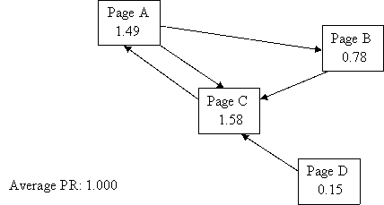

# Fast Personalized PageRank Implementation

I needed a fast PageRank for Wikisim project, it has to be fast enough to run real time on relatively large graphs. Networkx was the obvious tool to use, however, it needed back and forth translation from my graph representation (which was the pretty standard csr matrix), to its internal graph data structure. These translations were slowing down the process. 

I implemented two versions of the algorithm in Python, both inspired by the sparse fast solutions given in [**Cleve Moler**](https://en.wikipedia.org/wiki/Cleve_Moler)'s book, [*Experiments with MATLAB*](https://www.mathworks.com/content/dam/mathworks/mathworks-dot-com/moler/exm/chapters/pagerank.pdf). The power method is much faster with enough precision for our task. 

### Personalized PageRank
I modified the algorithm a little bit to be able to calculate **personalized PageRank** as well. 


### Comparison with Popular Python Implementations: Networkx and iGraph
Both implementations (exact solution and *power method*) are much faster than their correspondent methods in NetworkX. The *power method* is also faster than the iGraph latest implementation, *PRPACK*, which is also an eigen-vector based implementation. Benchmarking is done on a `ml.t3.2xlarge` SageMaker instance. 

## More Details on PageRank, its Implementation and Benchmarking
Detailed explanations can be found on the [notebook page](notebooks/Fast-PageRank.ipynb), or the [blog post](https://asajadi.github.io/data/2019/05/26/fast-pagerank.html).


## Usage
### Installation:
`pip install fast-pagerank`

### Example
Let's take Example 1 from https://www.cs.princeton.edu/~chazelle/courses/BIB/pagerank.htm 



Assuming A=0, B=1, C=2, D=3:

```
>>> import numpy as np
>>> from scipy import sparse
>>> from fast_pagerank import pagerank
>>> from fast_pagerank import pagerank_power
>>> A = np.array([[0,1], [0, 2], [1, 2],[2,0],[3,2]])
>>> weights = [1,1,1,1,1]
>>> G = sparse.csr_matrix((weights, (A[:,0], A[:,1])), shape=(4, 4))
>>> pr=pagerank(G, p=0.85)
>>> pr
array([0.37252685, 0.19582391, 0.39414924, 0.0375    ])
```

The output elements are essentially the same numbers written on the nodes, but normalized (multiply the vector by $4$ and you will get the same numbers) 

We can add personalization, or use *power method*:

```
>>> personalize = np.array([0.4, 0.2, 0.2, 0.4])
>>> pr=pagerank_power(G, p=0.85, personalize=personalize, tol=1e-6)
>>> pr
array([0.37817981, 0.18572635, 0.38609383, 0.05      ])
```